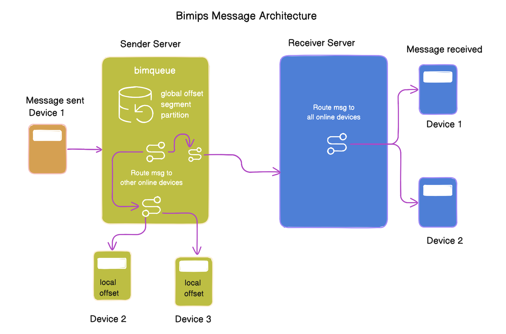

## 📩 **Message**




The `Message` is the core **Data Transfer Object (DTO)** in the system. It secures, transports, and routes all communication. Messages may include **end-to-end encryption (E2E)** or **transport encryption only**.

It encapsulates:

* The content (`payload`)
* Security metadata (`encryption_type`, `encrypted`, `signature`)
* Address information (`from`, `to`)
* Optional server metadata (`peer`) for stream synchronization.

---

## 📘 Protobuf Definition

```protobuf
message Message {
   string message_id = 1;
   Identity from = 2;
   Identity to = 3;
   int64 timestamp = 4;
   bytes payload = 5;
   string encryption_type = 6;
   string encrypted = 7;
   string signature = 8;
   optional int32 type = 9;         
   optional int32 transmission_mode = 10; 
   optional Peer peer = 11;
}
```

---

## 📘 Peer
```
 message Peer {
    string to = 1;
    int64 offset = 4;
  }

```
---

## 📝 Field Reference

|   Tag  | Field Name          | Type            | Description                                                                                                                                                                                                                                                                                                                                                                                                                                           | Source |
| :----: | :------------------ | :-------------- | :---------------------------------------------------------------------------------------------------------------------------------------------------------------------------------------------------------------------------------------------------------------------------------------------------------------------------------------------------------------------------------------------------------------------------------------------------- | :----- |
|  **1** | `message_id`        | `string`        | **Client-generated ID** for message tracking and acknowledgment.                                                                                                                                                                                                                                                                                                                                                                                      | Client |
|  **2** | `from`              | `Identity`      | The **sender's** identity.                                                                                                                                                                                                                                                                                                                                                                                                                            | Client |
|  **3** | `to`                | `Identity`      | The **recipient's** identity.                                                                                                                                                                                                                                                                                                                                                                                                                         | Client |
|  **4** | `timestamp`         | `int64`         | Message creation time in **epoch milliseconds**.                                                                                                                                                                                                                                                                                                                                                                                                      | Client |
|  **5** | `payload`           | `bytes`         | Raw message content (e.g., JSON), typically used if not E2E encrypted.                                                                                                                                                                                                                                                                                                                                                                                | Client |
|  **6** | `encryption_type`   | `string`        | Security scheme: `"none"`, `"AES256"`, **`"E2E"`**.                                                                                                                                                                                                                                                                                                                                                                                                   | Client |
|  **7** | `encrypted`         | `string`        | **Base64 ciphertext** of the content, if encrypted.                                                                                                                                                                                                                                                                                                                                                                                                   | Client |
|  **8** | `signature`         | `string`        | **Base64 digital signature** for **integrity and authentication**.                                                                                                                                                                                                                                                                                                                                                                                    | Client |
|  **9** | `type`              | `int32`         | **Origin/Target Classification**: `1=SENDER`, `2=DEVICE`, `3=RECEIVER` .                                                                                                                                                                                                                                                                                                                                                                              | Client |
| **10** | `transmission_mode` | `int32`         | **Server Delivery Method**: `1=pull`, `2=push`.                                                                                                                                                                                                                                                                                                                                                                                                       | Client |
| **11** | `peer`              | `optional Peer` | **Server-assigned stream metadata** The Peer message contains server-assigned stream synchronization metadata critical for reliability. It includes the base IDs of both the sender (from) and the recipient (to), along with the server's global stream offset (offset) for the current message and the recipient's stream offset (peer_offset) as known by the server, which are continuously exchanged to maintain reliable two-way communication. | Server |

---

## 🗂️ Message Type (`type`)

| Value | Name     | Description                                                                     |
| :---: | :------- | :------------------------------------------------------------------------------ |
|   1   | SENDER   | Message originated from the sender client.                                      |
|   2   | DEVICE   | Message sent from a device (multi-device scenario).                             |
|   3   | RECEIVER | Message originated on the receiver side (e.g., a read receipt or local action). |

---

## 🚀 Transmission Mode (`transmission_mode`)

| Value | Description                                                          |
| :---: | :------------------------------------------------------------------- |
|   1   | Pull: Recipient fetches the message when online.                     |
|   2   | Push: Server pushes the message immediately to the recipient device. |

---

## 🛡️ Encryption Types

|   Type   | Description                                                |
| :------: | :--------------------------------------------------------- |
|  `none`  | No encryption, payload in clear text.                      |
| `AES256` | Transport layer encryption only.                           |
|   `E2E`  | End-to-end encryption using recipient keys (X25519 / RSA). |

---

## 📝 Example: E2E Encrypted Message (Elixir)

```elixir
request = %Bimip.Message{
  message_id: "vcNAQcDoIIB4TCCAd0CAQAxggE2MIIBMgI",
  from: %Bimip.Identity{
    eid: "a@domain.com",
    connection_resource_id: "J5kL7o9pQ8rT6uV5wX4yZ3aBcD1fG0hI7jK"
  },
  to: %Bimip.Identity{
    eid: "b@domain.com"
  },
  timestamp: System.system_time(:millisecond),
  payload: Jason.encode!(%{
    data: "This is the test message",
    emoji: "👋",
    cdn_url: "www.dcn_dart/jbdchdbachbajds/image.png"
  }),
  encryption_type: "E2E",
  encrypted: "MIIB8AYJKoZIhvcNAQcDoIIB4TCCAd0CAQAxggE2MIIBMgIBADAfMA4GCSqGSIb3DQEBCwUwggExBgsqhkiG9w0BCwEw",
  signature: "SHA256-R4f0S4E3V7gH6tK2mP9Yc0B1dZ2eG3h4iJ5kL7o9pQ8rT6uV5wX4yZ3aBcD1fG0hI7jKmNlOpZqRsT"
}

message = %Bimip.MessageScheme{
  route: 6,
  payload: {:message, request}
}

binary = Bimip.MessageScheme.encode(message)
hex    = Base.encode16(binary, case: :upper)
```

---

## 🌐 Multi-language Examples

### JavaScript / Node.js

```javascript
const protobuf = require("protobufjs");

// Load your proto file
protobuf.load("dartmessage.proto")
  .then(root => {
    // Look up types
    const Message = root.lookupType("bimip.Message");
    const Identity = root.lookupType("bimip.Identity");
    const MessageScheme = root.lookupType("bimip.MessageScheme");

    // Payload JSON
    const payloadJson = {
      data: "This is the test message",
      emoji: "👋",
      cdn_url: "www.dcn_dart/jbdchdbachbajds/image.png"
    };

    // From and To identities
    const fromIdentity = Identity.create({
      eid: "a@domain.com",
      connectionResourceId: "J5kL7o9pQ8rT6uV5wX4yZ3aBcD1fG0hI7jK"
    });

    const toIdentity = Identity.create({
      eid: "b@domain.com"
    });

    // Message (conforms to Elixir Message struct)
    const request = Message.create({
      messageId: "vcNAQcDoIIB4TCCAd0CAQAxggE2MIIBMgI", // ✅ camelCase
      from: fromIdentity,
      to: toIdentity,
      timestamp: Date.now(),
      payload: Buffer.from(JSON.stringify(payloadJson)),
      encryptionType: "E2E",
      encrypted: "MIIB8AYJKoZIhvcNAQcDoIIB4TCCAd0CAQAxggE2MIIBMgIBADAfMA4GCSqGSIb3DQEBCwUwggExBgsqhkiG9w0BCwEw",
      signature: "SHA256-R4f0S4E3V7gH6tK2mP9Yc0B1dZ2eG3h4iJ5kL7o9pQ8rT6uV5wX4yZ3aBcD1fG0hI7jKmNlOpZqRsT",
      type: 1,
      transmissionMode: 2
    });

    // MessageScheme with oneof assignment
    const messageScheme = MessageScheme.create({
      route: 6,
      message: request // ✅ assign directly, matches Elixir {:message, request}
    });

    // Encode to binary and hex
    const binary = MessageScheme.encode(messageScheme).finish();
    const hex = Buffer.from(binary).toString("hex").toUpperCase();

    console.log("Binary:", binary);
    console.log("Hex:", hex);
  })
  .catch(err => console.error(err));


```

### Java

```java
import com.google.protobuf.ByteString;

Message request = Message.newBuilder()
    .setMessageId("vcNAQcDoIIB4TCCAd0CAQAxggE2MIIBMgI")
    .setFrom(Identity.newBuilder().setEid("a@domain.com").setConnectionResourceId("device-abc123").build())
    .setTo(Identity.newBuilder().setEid("b@domain.com").build())
    .setTimestamp(System.currentTimeMillis())
    .setPayload(ByteString.EMPTY) // empty since encrypted is used
    .setEncryptionType("E2E")
    .setEncrypted(encryptedPayload)
    .setSignature(signature)
    .build();

MessageScheme message = MessageScheme.newBuilder()
    .setRoute(6)
    .setPayload(MessageScheme.Payload.newBuilder().setMessage(request).build())
    .build();

byte[] binary = message.toByteArray();
String hex = javax.xml.bind.DatatypeConverter.printHexBinary(binary);

System.out.println("Binary length: " + binary.length);
System.out.println("Hex: " + hex);

```

### Kotlin

```kotlin
import com.google.protobuf.ByteString

val request = Message.newBuilder()
    .setMessageId("vcNAQcDoIIB4TCCAd0CAQAxggE2MIIBMgI")
    .setFrom(Identity.newBuilder().setEid("a@domain.com").setConnectionResourceId("device-abc123").build())
    .setTo(Identity.newBuilder().setEid("b@domain.com").build())
    .setTimestamp(System.currentTimeMillis())
    .setPayload(ByteString.EMPTY) // empty since encrypted is used
    .setEncryptionType("E2E")
    .setEncrypted(encryptedPayload)
    .setSignature(signature)
    .build()

val message = MessageScheme.newBuilder()
    .setRoute(6)
    .setPayload(MessageScheme.Payload.newBuilder().setMessage(request).build())
    .build()

val binary = message.toByteArray()
val hex = binary.joinToString("") { "%02X".format(it) }

println("Binary length: ${binary.size}")
println("Hex: $hex")

```

### Dart

```dart
import 'dart:typed_data';
import 'package:fixnum/fixnum.dart';
import 'generated/message.pb.dart'; // your compiled protobufs

final payloadJson = {
  "data": "This is the test message",
  "emoji": "👋",
  "cdn_url": "www.dcn_dart/jbdchdbachbajds/image.png"
};

final encryptedPayload = encryptForRecipient(jsonEncode(payloadJson), recipientKey);

final request = Message(
  messageId: "vcNAQcDoIIB4TCCAd0CAQAxggE2MIIBMgI",
  from: Identity(eid: "a@domain.com", connectionResourceId: "device-abc123"),
  to: Identity(eid: "b@domain.com"),
  timestamp: Int64(DateTime.now().millisecondsSinceEpoch),
  payload: Uint8List(0), // empty since encrypted is used
  encryptionType: "E2E",
  encrypted: encryptedPayload,
  signature: signature,
);

final message = MessageScheme(
  route: 6,
  payload: MessageScheme_Payload(message: request),
);

final binary = message.writeToBuffer();
final hex = binary.map((b) => b.toRadixString(16).padLeft(2, '0')).join().toUpperCase();

print("Binary length: ${binary.length}");
print("Hex: $hex");
final payloadJson = {
  "data": "This is the test message",
  "emoji": "👋",
  "cdn_url": "www.dcn_dart/jbdchdbachbajds/image.png"
};

final encryptedPayload = encryptForRecipient(jsonEncode(payloadJson), recipientKey);

final message = Message(
  messageId: "e2e123456",
  from: Identity(eid: "a@domain.com", connectionResourceId: "device-abc123"),
  to: Identity(eid: "b@domain.com"),
  timestamp: DateTime.now().millisecondsSinceEpoch,
  payload: Uint8List(0),
  encryptionType: "E2E",
  encrypted: encryptedPayload,
  signature: signature,
);
```

### Swift

```swift
import Foundation

let request = Message.with {
    $0.messageId = "vcNAQcDoIIB4TCCAd0CAQAxggE2MIIBMgI"
    $0.from = Identity.with { $0.eid = "a@domain.com"; $0.connectionResourceId = "device-abc123" }
    $0.to = Identity.with { $0.eid = "b@domain.com" }
    $0.timestamp = Int64(Date().timeIntervalSince1970 * 1000)
    $0.payload = Data() // empty since encrypted is used
    $0.encryptionType = "E2E"
    $0.encrypted = encryptedPayload
    $0.signature = signature
}

let message = MessageScheme.with {
    $0.route = 6
    $0.payload = MessageScheme.Payload.with { $0.message = request }
}

let binary = try! message.serializedData()
let hex = binary.map { String(format: "%02X", $0) }.joined()

print("Binary length: \(binary.count)")
print("Hex: \(hex)")

```
